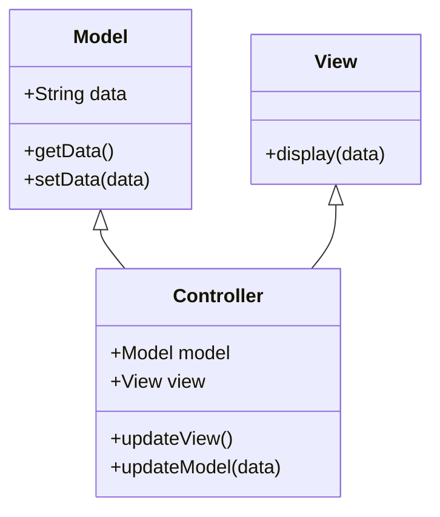

# Documentation

This projects apps are developed using *model-view-controller* architecture.

Below is a class diagram representing the MVC architecture:

```mermaid
classDiagram
    class Model {
        +String data
        +getData()
        +setData(data)
    }

    class View {
        +display(data)
    }

    class Controller {
        +Model model
        +View view
        +updateView()
        +updateModel(data)
    }

    Model <|-- Controller
    View <|-- Controller
```
